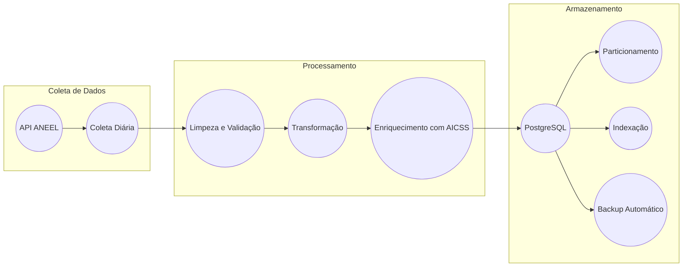

# 🔋 Lumion Dashboard - Sistema de Gestão Energética Residencial(CTWP)

  - [👀 Visão Geral](#-visão-geral)

  - [📁 Estrutura do Projeto](#-estrutura-do-projeto)

  - [🚀 Funcionalidades](#-funcionalidades)
        
  - [📋 Pré-requisitos](#-pré-requisitos)

  - [⚙️ Configuração](#️-configuração)
    

  - [🚀 Execução](#-execução)


## 👀 Visão Geral
Lumion Dashboard interativo para monitoramento e gestão de energia residencial usando Streamlit e Plotly. Com o objetivo de gerenciamento, otimização do consumo energético em residências, foco na redução de custos e aumento da eficiência.


## 📁 Estrutura do Projeto

* **energy-dashboard//**: Diretório raiz do projeto.
    * **energy_dashboard.py/**: Script principal
    * **requirements.txt/**: Dependências do projeto
    * **README.md:** Este arquivo
 
## 🚀 Funcionalidades
- Dashboard interativo com métricas em tempo real
- Gráfico de consumo energético
- Controles para modo de operação (Automático, Manual, Economia)
- Alertas e recomendações para economia de energia
- Geração de dados simulados para demonstração

## 📋 Pré-requisitos
- Python 3.7+
- pip (gerenciador de pacotes Python)

## ⚙️ Configuração
1. Clone o repositório:
'''
git clone https://github.com/seu-usuario/energy-dashboard.git
'''
'''
cd energy-dashboard

2. Instale as dependências:
'''
pip install -r requirements.txt
'''
PAREI AQUI
### Pré-requisitos
- Docker e Docker Compose
- Python 3.8+
- PostgreSQL 13+
- pip (Python package manager)


  - [📊 Pipeline de Dados](#-pipeline-de-dados)
    - [Coleta (ANEEL)](#coleta-aneel)
    - [Processamento](#processamento)
    - [Armazenamento](#armazenamento)

  - [🔗 Integração](#-integração)
    - [Com AICSS](#com-aicss)
    - [Com SCR](#com-scr)

  - [📈 Métricas e KPIs](#-métricas-e-kpis)

  - [🔒 Segurança](#-segurança)

  - [📚 Documentação API](#-documentação-api)

  - [🔄 Manutenção](#-manutenção)

  - [📱 Interface Web](#-interface-web)

  - [🌐 Endpoints API](#-endpoints-api)
    - [Dados ANEEL](#dados-aneel)
    - [Análise](#análise)
    - [Integração AICSS](#integração-aicss)

  - [📊 Visualização](#-visualização)
    - [Dashboards](#dashboards)
    - [Relatórios](#relatórios)

  - [🔗 Links Úteis](#-links-úteis)

  - [🤝 Contribuição](#-contribuição)

  - [📄 Licença](#-licença)


     


### Instalação
1. Clone o repositório:

```bash
git clone <repository-url>
cd cds
```
2. Configure o ambiente:

```python -m venv venv
source venv/bin/activate  # Linux/Mac
```
```
.\venv\Scripts\activate   # Windows
```
```
pip install -r requirements.txt
```

3. Configure as variáveis de ambiente:

```cp .env.example .env
# Edite .env com suas credenciais
```

## 🚀 Execução

1. Inicie os containers:

```
docker-compose up -d
```

2. Execute o pipeline:

```
python scripts/pipeline.py
```

## 📊 Pipeline de Dados

### Coleta (ANEEL)
O processo começa com a extração de dados diretamente da API da ANEEL, que permite o acesso a informações oficiais de maneira automatizada. Essa extração ocorre diariamente para assegurar que o banco de dados esteja sempre atualizado. Os dados são recebidos no formato JSON/CSV.
- API REST para dados oficiais
- Periodicidade: Diária
- Formato: JSON/CSV

### Processamento
Na etapa de processamento os dados passam pelas etapas listadas abaixo, para assegurar a qualidade e utilidade:

- Limpeza: São eliminados dados duplicados, inconsistentes ou inválidos, garantindo a integridade dos dados que serão armazenados.
- Validação: Os dados são checados para confirmar que atendem aos padrões esperados. Por exemplo, as datas devem estar em um formato correto, e os valores numéricos devem estar dentro de um intervalo aceitável.
- Transformação de formatos: Os dados podem ser convertidos para um formato mais adequado para armazenamento ou análise. Isso pode incluir a conversão de tipos de dados, o cálculo de novos valores ou a agregação de informações.
- Enriquecimento: Os dados coletados são complementados com informações adicionais do AICSS, proporcionando uma visão mais ampla e contextualizada, (referência em `aicss/readme.md`, linhas 447-450).


### Armazenamento
Os dados processados são armazenados em um banco de dados PostgreSQL, escolhemos esse SGBD, pois apresenta alta performance, escalabilidade e flexibilidade. Para otimizar o armazenamento e as consultas, são utilizadas as seguintes técnicas:

- Particionamento: As tabelas são divididas em partes menores (partições), melhorando o desempenho de consultas em grandes volumes de dados.
- Índices: foram criados índices em colunas para acelerar a busca por registros específicos.
- Backup Automático: O banco de dados é respaldado regularmente para garantir a recuperação dos dados em caso de falhas ou perdas acidentais.



## 🔗 Integração

Com AICSS - Sistema automatizado de controle de iluminação residencial que otimiza o consumo de energia através de sensores e automação inteligente. O sistema gerencia tanto a iluminação interna quanto externa, considerando fatores como luminosidade ambiente e presença de pessoas.
- Dados de sensores (referência em `aicss/src/main.cpp`, linhas 5-10)
- Métricas de consumo
- Alertas em tempo real

Com SCR - Realiza análise completa de dados de geração de energia distribuída, utilizando dados da Agência Nacional de Energia Elétrica - ANEEL, o código automatiza o download, processamento e análise de dados, gerando resultados estatísticos, gráficos e relatórios completos, facilitando a compreensão da geração de energia distribuída no Brasil.
- Exportação para análise R (referência em `aicss/readme.md`, linhas 457-460)
- Importação de predições
- Métricas de desempenho

## 📈 Métricas e KPIs
Métricas e KPIs são indicadores essenciais que nos ajudam a medir o desempenho e a eficácia de um sistema. No contexto de um sistema de análise de dados, como o Lumion Analytics, essas métricas são fundamentais para assegurar a qualidade dos resultados e otimizar os processos. A seguir, vamos detalhar cada uma das métricas mencionadas:

- Tempo de processamento ETL (Extract, Transform, Load): Essa métrica é importante porque um tempo de processamento reduzido assegura que o data warehouse seja atualizado rapidamente, o que permite análises mais ágeis e decisões baseadas em dados mais recentes. Para melhorar essa métrica, é possível otimizar as consultas SQL, utilizar ferramentas de ETL mais eficientes, aplicar paralelismo e realizar indexação.

- Latência de queries: O ideial é que essa métrica esteja sempre baixa, pois uma baixa latência permite que os usuários obtenham respostas rápidas às suas perguntas, o que facilita a tomada de decisões. Para melhorar essa métrica, é possível criar índices adequados, otimizar as consultas SQL, utilizar cache e investir em hardware mais potente.

- Taxa de sucesso de coleta: Essa métrica deve estar sempre alta, porque uma alta taxa de sucesso assegura a integridade dos dados e a confiabilidade das análises. Para melhorar essa métrica, é necessário monitorar as fontes de dados, implementar mecanismos de repetição e alertas para falhas, além de utilizar ferramentas de monitoramento robustas.

- Qualidade dos dados: Essa métrica mede a precisão, completude, consistência e relevância dos dados, ela é importante porque dados de alta qualidade são essenciais para gerar insights confiáveis e tomar decisões assertivas. Para melhorar essa métrica, é fundamental implementar processos de limpeza e validação de dados, realizar análises exploratórias de dados e utilizar ferramentas de profiling de dados.

## 🔒 Segurança
- Autenticação JWT: A assinatura digital assegura a integridade do token e previne qualquer manipulação. O servidor não precisa manter informações de sessão, o que torna o sistema mais escalável e seguro. E pode ser utilizado em uma variedade de aplicações e plataformas.

- SSL/TLS (Secure Sockets Layer/Transport Layer Security): Benefícios confidencialidade, integridade e autenticidade

- Backup Automático: Benefícios recuperação de dados, conformidade e tranquilidade

- Logs de auditoria: Benefícios investigação de incidentes, análise de comportamento e conformidade

## 📚 Documentação API
Disponível em: `/docs/api.md`

## 🔄 Manutenção
- Backup diário automatizado
- Monitoramento 24/7
- Alertas em tempo real
- Logs detalhados

## 📱 Interface Web
- Dashboard em tempo real
- Gráficos interativos
- Relatórios customizados
- Controle de acesso

## 🌐 Endpoints API

### Dados ANEEL

``` http
GET /api/v1/aneel/consumo
GET /api/v1/aneel/tarifas
POST /api/v1/aneel/sync
```

### Análise

``` http
GET /api/v1/analytics/consumo
GET /api/v1/analytics/previsao
GET /api/v1/analytics/relatorios
```
### Integração AICSS

``` http
POST /api/v1/aicss/dados
GET /api/v1/aicss/status
PUT /api/v1/aicss/config
```

## 📊 Visualização

### Dashboards
- Consumo em tempo real
- Histórico por período
- Previsões futuras
- Alertas e notificações

### Relatórios
- Diários
- Semanais
- Mensais
- Personalizados

## 🔗 Links Úteis
- [Documentação API](/docs/api.md)
- [Guia de Contribuição](/CONTRIBUTING.md)
- [Changelog](/CHANGELOG.md)

## 🤝 Contribuição
1. Fork o projeto
2. Crie sua branch (`git checkout -b feature/AmazingFeature`)
3. Commit suas mudanças (`git commit -m 'Add some AmazingFeature'`)
4. Push para a branch (`git push origin feature/AmazingFeature`)
5. Abra um Pull Request

## 📄 Licença
Distribuído sob a licença MIT. Veja `LICENSE` para mais informações.
