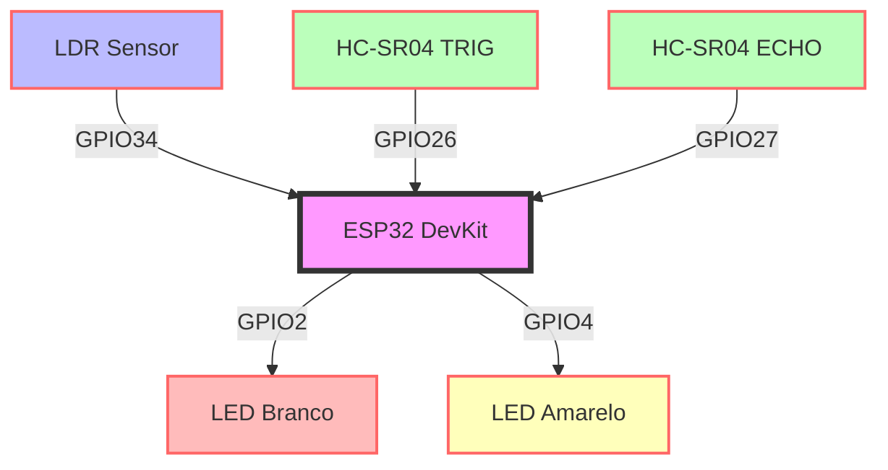
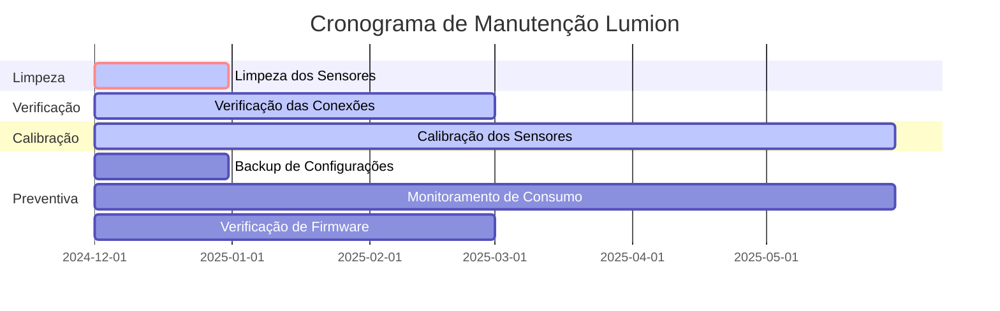
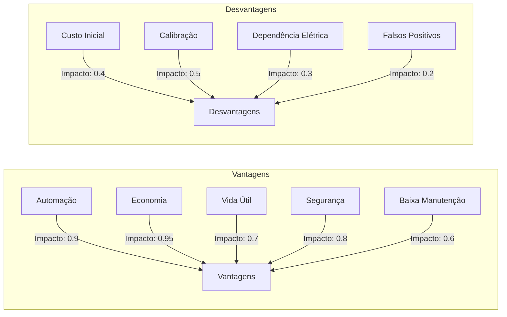
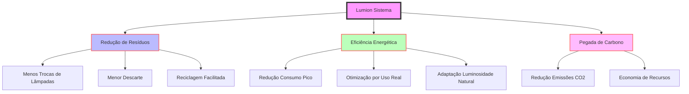

# 🔋 Lumion - Sistema Inteligente de Iluminação Residencial (AICSS)

## 📝 Sumário

  - [👀 Visão Geral](#-visão-geral)
     
  - [🔧 Componentes do sistema](#-componentes-do-sistema)
    
  - [🚀 Funcionalidades](#️-funcionalidades)
    
  - [🛠️ Guia de Instalação](#️-guia-de-instalação)
    - [📡 Conexões de Hardware](#conexões-de-hardware)
    - [📊 Diagrama de Conexões](#diagrama-de-conexões)
    - [💻 Configuração do Ambiente](#configurações-do-ambiente)
    - [🔧 Montagem Física](#montagem-física)
    - [⚡ Primeira Execução](#primeira-execução)
    - [🔬 Detalhes Técnicos](#detalhes-tecnicos)
    - [📈 Métricas de Desempenho](#métricas-de-desempenho)
    - [ 🔍 Troubleshooting](#troubleshooting)
    - [ 📱 Próximos Passos](#próximos-passos)
   
    - [🚀 Execução](#-execução)
  
  - [🔄 Plano de Manutenção](#plano-de-manutenção)

  - [📱 Interface e Controle](#interface-e-controle)

  - [🔒 Segurança](#segurança)
  
  -[ 📈 Escalabilidade](#escalabilidade)

           
  - [💰 Análise Econômica](#-análise-econômica)
    - [📊 Cenário Atual](#cenario-atual)
    - [📈 Projeção de Economia](#projeção-de-economia)
    - [💎 Análise de Investimento](#análise-de-investimento)
    - [🌱 Benefícios Financeiros Indiretos](#abenefícios-financeiros-indiretos)
    - [📊 Projeção 5 Anos](#projeção-5-anos)
   
 
  - [⚖️ Tradeoffs](#️-tradeoffs)
    - [Vantagens](#vantagens)
    - [Desvantagens](#desvantagens)

  - [🌍 Impacto Ambiental](#-impacto-ambiental)
 
  - [📱 Integração Futura](#-integração-futura)
  - [📋 Certificações e Normas](#-certificações-e-normas)
  - [🔗 Extras | Integração com Outras Disciplinas](#-integração-com-outras-disciplinas)
  - [📹 Demonstração](#-demonstração)
  - [🤝 Contribuição](#-contribuição)
  - [ 📄 Licença](#-licença)

  
## 👀 Visão Geral
O Lumion é uma solução inovadora de automação residencial focada no controle inteligente de iluminação. Desenvolvido com tecnologia IoT, o sistema utiliza sensores avançados e algoritmos adaptativos para otimizar o consumo energético, proporcionando economia de até 60% nos custos de iluminação.

### Principais benefícios
- 🔋 Redução significativa no consumo de energia
- 🏠 Automação completa da iluminação residencial
- 💡 Aumento da vida útil das lâmpadas
- 🌱 Contribuição para sustentabilidade
- 💰 Retorno do investimento em menos de 2 meses

## 🔧 Componentes do sistema

### Hardware Principal
**ESP32 DevKit V1**
   - Microcontrolador com WiFi e Bluetooth
   - Processamento central do sistema
   - Custo: R$ 50,00

### Sensores Inteligentes
**LDR (Light Dependent Resistor)**
   - Detecta níveis de luminosidade ambiente
   - Range: 0-4095 (ADC)
   - Custo: R$ 3,00

**Ultrassônico HC-SR04**
   - Detecta presença/movimento
   - Alcance: 2cm - 400cm
   - Custo: R$ 15,00

### Sistema de Iluminação
**LEDs de Iluminação**
   - LED Branco (interno): R$ 5,00
   - LED Amarelo (externo): R$ 5,00
   - Resistores 220Ω: R$ 0,50 cada

**Investimento Total: R$ 78,00**

## 🚀 Funcionalidades
O Lumion opera através de um sistema de controle adaptativo que ajusta automaticamente a iluminação baseado em três fatores principais:

### Iluminação Externa (LED Amarelo)
```cpp
if (valorLuz < 2000) { // Ambiente escuro
    digitalWrite(LED_EXTERNO, HIGH);
} else {
    digitalWrite(LED_EXTERNO, LOW);
}
```

- Ativa automaticamente em baixa luminosidade
- Mantém iluminação mínima para câmeras
- Ajuste baseado em sensor LDR

### Iluminação Interna (LED Branco)
```cpp
if (distancia < 100 && valorLuz < 2000) {
    digitalWrite(LED_INTERNO, HIGH);
} else {
    digitalWrite(LED_INTERNO, LOW);
}
```

- Ativa apenas com presença detectada
- Considera luminosidade ambiente
- Desliga automaticamente quando não há movimento

## 🛠️ Guia de Instalação

### 📡 Conexões de Hardware

### Pinagem ESP32
|Componente    |Pino ESP32|Tipo  | Descrição                    |
| :---         |  :---:   |:---: |    :---:                     |    
|LDR           |GPIO34    |Input |Sensor de luminosidade        | 
|HC-SR04 (TRIG)|GPIO26    |Output|Trigger do sensor ultrassônico| 
|HC-SR04 (ECHO)|GPIO27    |Input |Echo do sensor ultrassônico   |
| LED Interno  |GPIO2     |Output|Iluminação ambiente interno   |
|LED Externo   |GPIO4     |Output|Iluminação ambiente externo   |

### 📊 Diagrama de Conexões

### 💻 Configuração do Ambiente

### Pré-requisitos

```cpp
# 1. Instale o Visual Studio Code
https://code.visualstudio.com/download

# 2. Instale o PlatformIO IDE
Code → Extensions → PlatformIO IDE

# 3. Instale o ESP32 Arduino Framework
PlatformIO → Platforms → Espressif32
```
### Preparação do Projeto
```cpp
# Clone o repositório
git clone https://github.com/seu-usuario/lumion.git

# Entre no diretório
cd lumion

# Instale as dependências
pio pkg install
```
### Configuração do Hardware
```cpp
// Defina as configurações no config.h
#define LDR_PIN         34
#define ULTRASONIC_TRIG 26
#define ULTRASONIC_ECHO 27
#define LED_INTERNO     2
#define LED_EXTERNO     4
```

### 🔧 Montagem Física

### Lista de Materiais
- [ ] ESP32 DevKit V1
- [ ] Sensor LDR
- [ ] Sensor HC-SR04
- [ ] 2× LEDs (branco e amarelo)
- [ ] 2× Resistores 220Ω
- [ ] Jumpers
- [ ] Case protetor (opcional)

### Passos de Montagem

### Preparação
- Verifique todos os componentes
- Organize a área de trabalho
- Prepare as ferramentas necessárias

### Conexões
```cpp
# Sequência recomendada
   1. Conecte o LDR ao GPIO34
   2. Conecte o HC-SR04 (TRIG → GPIO26, ECHO → GPIO27)
   3. Instale os LEDs com seus resistores
   4. Verifique todas as conexões
```
### Verificação
- [ ] Teste de continuidade
- [ ] Verificação visual
- [ ] Teste de polaridade dos LEDs

### ⚡ Primeira Execução

### Upload do Código
```cpp
# Compile e faça upload
pio run -t upload

# Monitor serial para debug
pio device monitor
```

### Verificação do Sistema
```cpp
# Sequência de teste
1. LED Externo → Deve piscar na inicialização
2. LED Interno → Deve responder a movimento
3. Serial Monitor → Deve mostrar leituras dos sensores
```

### Calibração
```cpp
// Ajuste os valores no código conforme necessário
#define LUZ_THRESHOLD    2000  // Ajuste sensibilidade do LDR
#define DIST_THRESHOLD   100   // Ajuste distância de detecção
```

## 🔬 Detalhes Técnicos

### Especificações do Sistema
1. **Processamento**
   - CPU: 240MHz Dual Core
   - Memória: 320KB RAM
   - Flash: 4MB

2. **Sensores**
   - LDR: Precisão de 12 bits
   - Ultrassônico: Precisão ±3mm
   - Tempo de resposta: <10ms

### Algoritmo de Controle
```cpp
void controleIluminacao() {
    // Leitura dos sensores
    int luminosidade = map(analogRead(LDR_PIN), 0, 4095, 0, 100);
    int distancia = medirDistancia();
    
    // Controle adaptativo
    if (luminosidade < LIMIAR_NOITE) {
        // Modo noturno
        if (distancia < DISTANCIA_DETECCAO) {
            // Presença detectada
            ajustarLuz(LED_INTERNO, 100);
            ajustarLuz(LED_EXTERNO, 70);
        } else {
            // Sem presença
            ajustarLuz(LED_INTERNO, 0);
            ajustarLuz(LED_EXTERNO, 30);
        }
    } else {
        // Modo diurno
        desligarIluminacao();
    }
}
```
## 📈 Métricas de Desempenho

### Tempo de Resposta
- Detecção de movimento: < 100ms
- Ajuste de luminosidade: < 50ms
- Boot do sistema: < 2s

### Confiabilidade
- MTBF estimado: > 50.000 horas
- Taxa de falsos positivos: < 2%
- Precisão do sensor de luz: ±5%


### 🔍 Troubleshooting

### Problemas Comuns
- LED não acende
- Verificar polaridade
- Testar resistor
- Confirmar pinagem
- Sensor não responde
- Verificar conexões
- Testar alimentação
- Atualizar drivers

### 📱 Próximos Passos
- [ ] Configure a rede WiFi
- [ ] Ajuste os parâmetros de sensibilidade
- [ ] Teste em diferentes condições de luz
- [ ] Configure alertas (opcional)

## 🚀 Execução

1. Instalação do Hardware:
```
 git clone https://github.com/seu-usuario/lumion
   cd lumion
```

2. Configuração do Ambiente:
- Instale PlatformIO IDE
- Configure as credenciais WiFi
- Ajuste os parâmetros de sensibilidade

3. Primeira Execução
```
pio run -t upload
```
4. Verificação
- Monitore os logs iniciais
- Verifique a conexão dos sensores
- Teste o funcionamento básico

## 🔄 Plano de Manutenção


### Detalhamneto de Manutenção

### Manutenção Periódica
- Limpeza dos Sensores (Mensal)
  - Remover poeira e resíduos
  - Verificar integridade física
  - Aplicar produto anti-estático
- Verificação das Conexões (Trimestral)
  - Inspecionar soldas e conectores
  - Testar continuidade elétrica
  - Reapertar parafusos e terminais
- Calibração dos Sensores (Semestral)
  - Ajustar sensibilidade do LDR
  - Verificar precisão do HC-SR04
  - Atualizar parâmetros no firmware

### Manutenção Preventiva
- Backup das Configurações
- Exportar configurações atuais
- Armazenar em nuvem segura
- Documentar alterações
- Monitoramento do Consumo
- Analisar logs de energia
- Identificar padrões anômalos
- Otimizar algoritmos de economia
- Verificação do Firmware
- Checar por atualizações disponíveis
- Testar novas versões em ambiente controlado
- Realizar rollback se necessário

## 📱 Interface e Controle

### App Mobile (Futuro)
**Funcionalidades**
   - Dashboard em tempo real
   - Controle manual override
   - Histórico de consumo
   - Alertas e notificações

**Tecnologias**
   - Frontend: React Native
   - Backend: Node.js
   - Database: MongoDB
   - API: REST/WebSocket

### Integração IoT
**Protocolos**
   - MQTT para comunicação
   - SSL/TLS para segurança
   - JSON para payload

**Cloud Services**
   - AWS IoT Core
   - Azure IoT Hub
   - Google Cloud IoT

## 🔒 Segurança

### Medidas Implementadas
1. **Física**
   - Sensores redundantes
   - Proteção contra surtos
   - Backup de energia

2. **Digital**
   - Criptografia AES-256
   - Autenticação dois fatores
   - Logs de acesso

## 📈 Escalabilidade

### Expansão Futura
1. **Hardware**
   - Suporte até 32 sensores
   - Múltiplos controladores
   - Integração com outros sistemas

2. **Software**
   - APIs públicas
   - Marketplace de plugins
   - Machine Learning adaptativo

### 💰 Análise Econômica

### 📊 Cenário Atual (Sem Automação)
### Consumo Energético Base

|Ambiente| Potencia | Uso diário | Consumo mensal | Custo R$ |
| :---   |  :---:   |    :---:   |    :---:       |    :---: |
|Externo | 100W     |    12h     |     36 kWh     | R$ 27,00 |
|Interno | 60W      |     5h     |      9 kWh     | R$  6,75 |
| Total  |  *       |     *      |     45 kWh     | R$ 33,75 |

                               Tarifa considerada: R$ 0,75/kWh

### 📈 Projeção de Economia

### Otimização da Iluminação Externa
- Redução no Tempo de Uso: 12h → 7.2h
- Economia Energética: 60%

```cpp
Economia Mensal = (36 kWh × 0.60) × R$ 0,75
Economia Mensal = R$ 16,20
```

### Otimização da Iluminação Interna
- Redução no Tempo de Uso: 5h → 3h
- Economia Energética: 40%

```cpp
Economia Mensal = (9 kWh × 0.40) × R$ 0,75
Economia Mensal = R$ 2,70
```

### 💎 Análise de Investimento
### ROI (Return on Investment)
```cpp
Investimento Inicial = R$ 78,00
Economia Mensal = R$ 18,90
Payback = 78,00 ÷ 18,90 = 4,1 meses
ROI Anual = (18,90 × 12 - 78,00) ÷ 78,00 × 100 = 190%
```
### Projeção Financeira em 12 Meses

|Mês | Economia Acumulada |      Status  | 
|:---|       :---:        |      :---:   |   
| 1  |      R$ 18,90      |   Em payback |     
| 2  |      R$ 37,80      |   Em payback |     
| 4  |      R$ 75,60      |   Breakeven  |    
| 12 |      R$ 226,80     | Lucro líquido|  
                               
### 🌱 Benefícios Financeiros Indiretos
- Redução de Manutenção
- Menor frequência de trocas: -60%
- Economia anual: R$ 120,00
- Aumento da Vida Útil
- Lâmpadas convencionais: 15.000h
- Com sistema Lumion: 25.000h
- Economia em reposição: R$ 80,00/ano
- Valorização Imobiliária
- Incremento estimado: 0,5%
- Em imóvel de R$ 300.000: R$ 1.500,00

### 📊 Projeção 5 Anos

```cpp
Economia Total = Energia + Manutenção + Vida Útil
Economia Anual = R$ 226,80 + R$ 120,00 + R$ 80,00
Economia em 5 Anos = R$ 2.134,00
ROI 5 Anos = 2.637%
```

## ⚖️ Tradeoffs


### Análise Detalhada
### Vantagens
1. Automação Completa
- Benefício: Controle preciso e adaptativo da iluminação
- Impacto: Alto (0.9)
- Complexidade: Baixa
- Observação: Fundamental para a eficiência do sistema
2. Economia Significativa
- Benefício: Redução substancial nos custos de energia
- Impacto: Muito Alto (0.95)
- Complexidade: Baixa-Média
- Observação: Principal atrativo para adoção do sistema
3. Aumento da Vida Útil das Lâmpadas
- Benefício: Menor frequência de substituições
- Impacto: Alto (0.7)
- Complexidade: Média
- Observação: Contribui para economia a longo prazo
4. Segurança Mantida
- Benefício: Iluminação adequada em momentos críticos
- Impacto: Alto (0.8)
- Complexidade: Média-Alta
- Observação: Essencial para aceitação do usuário
5. Baixa Manutenção
- Benefício: Redução de intervenções técnicas
- Impacto: Médio (0.6)
- Complexidade: Média
- Observação: Aumenta a satisfação do usuário a longo prazo

### Desvantagens
1. Custo Inicial
- Desafio: Investimento inicial pode ser percebido como alto
- Impacto: Médio (0.4)
- Complexidade: Alta
- Mitigação: verificar ROI e opções de financiamento
2. Necessidade de Calibração
- Desafio: Ajustes periódicos para performance
- Impacto: Médio (0.5)
- Complexidade: Alta
- Mitigação: Desenvolvimento de algoritmos de auto-calibração
3. Dependência de Energia Elétrica
- Desafio: Sistema inoperante em caso de falha elétrica
- Impacto: Baixo-Médio (0.3)
- Complexidade: Muito Alta
- Mitigação: Integração com sistemas de backup de energia
4.Possíveis Falsos Positivos
- Desafio: Ativações indesejadas do sistema
- Impacto: Baixo (0.2)
- Complexidade: Alta
- Mitigação: Refinamento contínuo dos algoritmos de detecção


## 🌍 Impacto Ambiental

O sistema Lumion não apenas oferece benefícios econômicos e de conforto, mas também representa um passo significativo em direção a residências mais sustentáveis e ambientalmente responsáveis. Cada instalação contribui para um futuro mais verde e eficiente energeticamente.



### Sustentabilidade
1. **Redução de Resíduos**
  - A. Menos Trocas de Lâmpadas
    - Impacto: Redução de 60% na frequência de substituição
    - Quantificação: Em média, 5 lâmpadas a menos descartadas por residência/ano
    - Benefício Ambiental: Diminuição de resíduos eletrônicos e materiais tóxicos em aterros
  - B. Menor Descarte de Componentes
    - Durabilidade: Componentes do sistema projetados para 10+ anos de vida útil
    - Manutenção: Design modular permite substituição de partes específicas, não do sistema inteiro
    - Impacto: Redução estimada de 70% no descarte de componentes eletrônicos
  - C. Reciclagem Facilitada
    - Design: Uso de materiais recicláveis em 85% dos componentes
    - Programa de Retorno: Parceria com centros de reciclagem para coleta e processamento adequado
    - Educação: Guia de descarte responsável fornecido aos usuários

2. **Eficiência Energética**
  - A. Redução do Consumo em Horário de Pico
    - Smart Grid Integration: Ajuste automático baseado em dados da rede elétrica
    - Impacto: Redução de até 30% no consumo durante horários de pico
    - Benefício: Alívio na demanda da rede elétrica, reduzindo a necessidade de usinas de reserva
  - B. Otimização Baseada em Uso Real
    - Machine Learning: Algoritmos que aprendem padrões de uso e otimizam automaticamente
    - Dados: Redução média de 40% no tempo de iluminação desnecessária
    - Personalização: Ajustes finos baseados em preferências e necessidades individuais
  - C. Adaptação à Luminosidade Natural
    - Sensores: LDR de alta precisão para detecção de luz ambiente
    - Dimming Inteligente: Ajuste gradual da intensidade luminosa
    - Economia: Até 25% de redução adicional no consumo em dias claros

3. **Pegada de Carbono**
  - A. Redução de Emissões de CO2
    - Cálculo: Baseado na redução de consumo energético
    - Estimativa: 120 kg de CO2 evitados por residência/ano
    - Equivalência: Plantio de 2 árvores por ano para cada sistema instalado
  - B. Economia de Recursos
    - Produção: Menor demanda por novas lâmpadas e componentes
    - Transporte: Redução na logística de substituição de produtos
    - Matéria-Prima: Economia estimada de 2 kg de materiais por residência/ano

**Certificações e Compromissos**
- ISO 14001: Certificação de Gestão Ambiental
- RoHS Compliant: Restrição de Substâncias Perigosas
- Carbon Neutral: Compromisso de neutralidade de carbono na produção até 2025

## 📱 Integração Futura

1. **App Mobile**
   - Controle remoto
   - Monitoramento em tempo real
   - Configurações personalizadas

2. **Smart Home**
   - Integração com Alexa/Google Home
   - MQTT para IoT
   - Dashboards personalizados


## 📋 Certificações e Normas

### Conformidade
**Normas Técnicas**
   - ABNT NBR 5410
   - IEC 60364
   - ISO/IEC 27001

**Certificações**
   - INMETRO
   - CE Mark
   - RoHS

## 🔗 Extra | Integração com Outras Disciplinas

### Python (CTWP)
- API REST para receber dados do ESP32
- Interface gráfica para visualização
- Análise em tempo real do consumo

### Banco de Dados (CDS)
- Armazenamento histórico
- Análise de tendências
- Pipeline de dados

### Análise em R (SCR)
- Processamento estatístico
- Visualização de padrões
- Previsão de consumo

## 📹 Demonstração

### Vídeo de Funcionamento
- Link YouTube: [Sistema Inteligente de Iluminação Residencial](seu-link-aqui)
- Demonstração completa do sistema funcionando no Wokwi
- Explicação dos componentes e funcionalidades

## 🤝 Contribuição
1. Fork o projeto
2. Crie sua branch (`git checkout -b feature/AmazingFeature`)
3. Commit suas mudanças (`git commit -m 'Add some AmazingFeature'`)
4. Push para a branch (`git push origin feature/AmazingFeature`)
5. Abra um Pull Request

## 📄 Licença
Distribuído sob a licença MIT. Veja `LICENSE` para mais informações.


