# 🔋 Sistema de Análise de Consumo Energético (CDS)

## 📝 Sumário
- [🔋 Sistema de Análise de Consumo Energético (CDS)](#-sistema-de-análise-de-consumo-energético-cds)
  - [📝 Sumário](#-sumário)
  - [👀 Visão Geral](#-visão-geral)
  - [🏗 Arquitetura](#-arquitetura)
  - [📁 Estrutura do Projeto](#-estrutura-do-projeto)
  - [⚙️ Configuração](#️-configuração)
    - [Pré-requisitos](#pré-requisitos)
    - [Instalação](#instalação)
- [Edite .env com suas credenciais](#edite-env-com-suas-credenciais)
  - [🚀 Execução](#-execução)
  - [📊 Pipeline de Dados](#-pipeline-de-dados)
    - [Coleta (ANEEL)](#coleta-aneel)
    - [Processamento](#processamento)
    - [Armazenamento](#armazenamento)
  - [🔗 Integração](#-integração)
    - [Com AICSS](#com-aicss)
    - [Com SCR](#com-scr)
  - [📈 Métricas e KPIs](#-métricas-e-kpis)
  - [🔒 Segurança](#-segurança)
  - [📚 Documentação API](#-documentação-api)
  - [🔄 Manutenção](#-manutenção)
  - [📱 Interface Web](#-interface-web)
  - [🌐 Endpoints API](#-endpoints-api)
    - [Dados ANEEL](#dados-aneel)
    - [Análise](#análise)
    - [Integração AICSS](#integração-aicss)
  - [🤝 Contribuição](#-contribuição)
  - [📊 Visualização](#-visualização)
    - [Dashboards](#dashboards)
    - [Relatórios](#relatórios)
  - [📄 Licença](#-licença)
  - [🔗 Links Úteis](#-links-úteis)

## 👀 Visão Geral
Sistema de análise de consumo energético que integra dados da ANEEL com informações do sistema AICSS que é um sistema automatizado de controle de iluminação residencial que otimiza o consumo de energia através de sensores e automação inteligente. O sistema gerencia tanto a iluminação interna quanto externa, considerando fatores como luminosidade ambiente e presença de pessoas. Essa integração tem como objetivo fornecer insights sobre padrões de consumo e eficiência energética.

## 🏗 Arquitetura

 ```mermaid
graph TD
    A(ANEEL API) --> ETL
    B(AICSS Data) --> ETL
    C(Sensor Data) --> ETL
  
    ETL --> D{PostgreSQL DB}
    D --> E(Analytics Layer)
    E --> F(Visualização)
    E --> G(Predições)
```

## 📁 Estrutura do Projeto

* **cds/**: Diretório raiz do projeto.
    * **docker/**: Contém os arquivos de configuração e Dockerfiles para a criação dos containers.
    * **scripts/**: Scripts Python utilizados para o processo de ETL (Extract, Transform, Load).
        * **crawler.py:** Coleta dados da ANEEL.
        * **etl.py:** Realiza o processamento dos dados.
        * **pipeline.py:** Orquestra todo o processo de ETL.
    * **sql/**: Contém os scripts SQL para criação das tabelas e execução das consultas.
        * **schema.sql:** Define o esquema do banco de dados.
        * **queries/**: Contém as consultas SQL utilizadas no processo.
    * **data/**: Armazena os dados brutos e processados.
    * **README.md:** Este arquivo.

## ⚙️ Configuração

### Pré-requisitos
- Docker e Docker Compose
- Python 3.8+
- PostgreSQL 13+
- pip (Python package manager)

### Instalação
1. Clone o repositório:

```bash
git clone <repository-url>
cd cds
```
2. Configure o ambiente:

```python -m venv venv
source venv/bin/activate  # Linux/Mac
```
```
.\venv\Scripts\activate   # Windows
```
```
pip install -r requirements.txt
```

3. Configure as variáveis de ambiente:

```cp .env.example .env
# Edite .env com suas credenciais
```

## 🚀 Execução

1. Inicie os containers:

```
docker-compose up -d
```

2. Execute o pipeline:

```
python scripts/pipeline.py
```

## 📊 Pipeline de Dados

### Coleta (ANEEL)
O processo começa com a extração de dados diretamente da API da ANEEL, que permite o acesso a informações oficiais de maneira automatizada. Essa extração ocorre diariamente para assegurar que o banco de dados esteja sempre atualizado. Os dados são recebidos no formato JSON.
- API REST para dados oficiais
- Periodicidade: Diária
- Formato: JSON/CSV

### Processamento
Na etapa de processamento os dados passaam etapas listadas abaixo para assegurar sua qualidade e utilidade:

- Limpeza: São eliminados dados duplicados, inconsistentes ou inválidos, garantindo a integridade dos dados que serão armazenados.
- Validação: Os dados são checados para confirmar que atendem aos padrões esperados. Por exemplo, as datas devem estar em um formato correto, e os valores numéricos devem estar dentro de um intervalo aceitável.
- Transformação de formatos: Os dados podem ser convertidos para um formato mais adequado para armazenamento ou análise. Isso pode incluir a conversão de tipos de dados, o cálculo de novos valores ou a agregação de informações.
- Enriquecimento: Os dados coletados são complementados com informações adicionais do AICSS, proporcionando uma visão mais ampla e contextualizada, (referência em `aicss/readme.md`, linhas 447-450).


### Armazenamento
Os dados processados são armazenados em um banco de dados PostgreSQL. Escolhemos esse SGBD pois apresenta alta performance, escalabilidade e flexibilidade. Para otimizar o armazenamento e as consultas, são utilizadas as seguintes técnicas:

- Particionamento: As tabelas são divididas em partes menores (partições), melhorando o desempenho de consultas em grandes volumes de dados.
- Índices: foram criados índices em colunas para acelerar a busca por registros específicos.
- Backup Automático: O banco de dados é respaldado regularmente para garantir a recuperação dos dados em caso de falhas ou perdas acidentais.

```mermaid
flowchart LR
    subgraph Coleta de Dados
        A((API ANEEL)) --> B((Coleta Diária))
    end

    subgraph Processamento
        B --> C((Limpeza e Validação))
        C --> D((Transformação))
        D --> E((Enriquecimento com AICSS))
    end

    subgraph Armazenamento
        E --> F((PostgreSQL))
        F --> G((Particionamento))
        F --> H((Indexação))
        F --> I((Backup Automático))
    end
```



## 🔗 Integração

### Com AICSS
- Dados de sensores (referência em `aicss/src/main.cpp`, linhas 5-10)
- Métricas de consumo
- Alertas em tempo real

### Com SCR
- Exportação para análise R (referência em `aicss/readme.md`, linhas 457-460)
- Importação de predições
- Métricas de desempenho

## 📈 Métricas e KPIs
- Tempo de processamento ETL
- Latência de queries
- Taxa de sucesso de coleta
- Qualidade dos dados

## 🔒 Segurança
- Autenticação JWT
- SSL/TLS
- Backup automático
- Logs de auditoria

## 📚 Documentação API
Disponível em: `/docs/api.md`

## 🔄 Manutenção
- Backup diário automatizado
- Monitoramento 24/7
- Alertas em tempo real
- Logs detalhados

## 📱 Interface Web
- Dashboard em tempo real
- Gráficos interativos
- Relatórios customizados
- Controle de acesso

## 🌐 Endpoints API

### Dados ANEEL

``` http
GET /api/v1/aneel/consumo
GET /api/v1/aneel/tarifas
POST /api/v1/aneel/sync
```

### Análise

``` http
GET /api/v1/analytics/consumo
GET /api/v1/analytics/previsao
GET /api/v1/analytics/relatorios
```
### Integração AICSS

``` http
POST /api/v1/aicss/dados
GET /api/v1/aicss/status
PUT /api/v1/aicss/config
```

## 🤝 Contribuição
1. Fork o projeto
2. Crie sua branch (`git checkout -b feature/AmazingFeature`)
3. Commit suas mudanças (`git commit -m 'Add some AmazingFeature'`)
4. Push para a branch (`git push origin feature/AmazingFeature`)
5. Abra um Pull Request


## 📊 Visualização

### Dashboards
- Consumo em tempo real
- Histórico por período
- Previsões futuras
- Alertas e notificações

### Relatórios
- Diários
- Semanais
- Mensais
- Personalizados

## 📄 Licença
Distribuído sob a licença MIT. Veja `LICENSE` para mais informações.

## 🔗 Links Úteis
- [Documentação API](/docs/api.md)
- [Guia de Contribuição](/CONTRIBUTING.md)
- [Changelog](/CHANGELOG.md)
